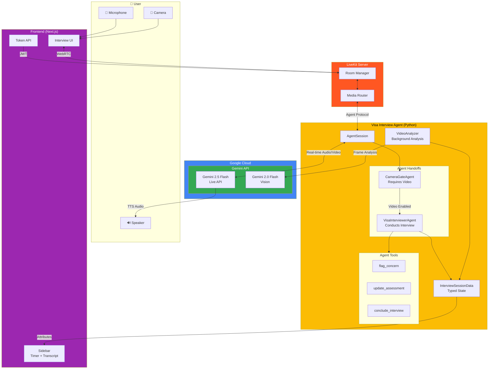
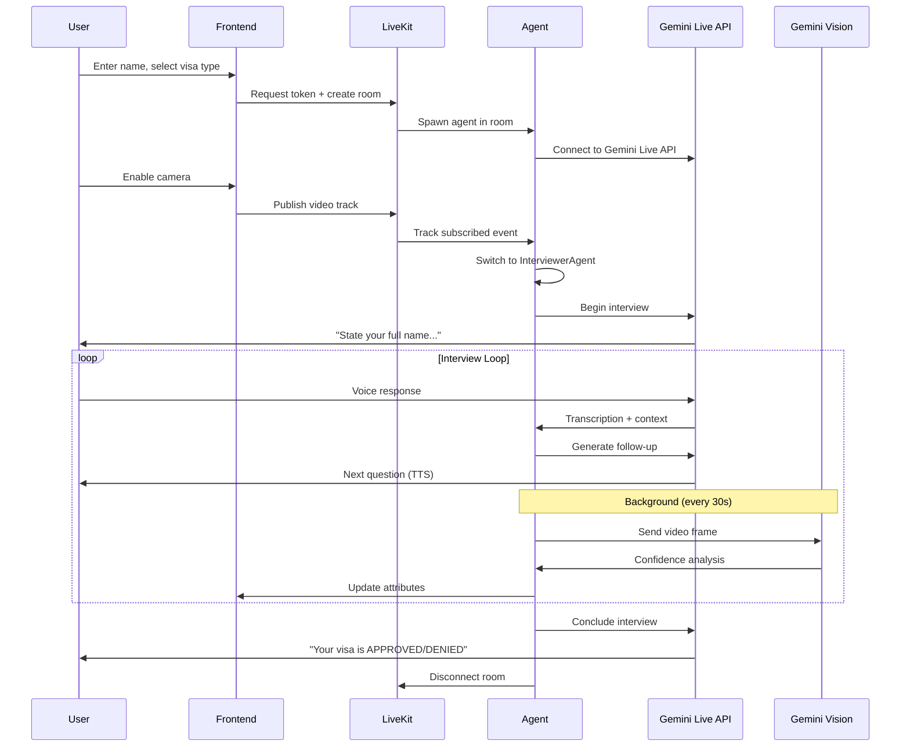

# Visa Interview Agent

> A real-time AI-powered mock visa interview simulator built for the **Gemini Live Agent Challenge**

**Category: Live Agents**

## Overview

Visa Interview Agent is a next-generation AI agent that conducts realistic mock visa interviews using **multimodal inputs and outputs**. Users interact with "Officer Martinez" - an AI visa officer who can **see**, **hear**, and **speak** in real-time, providing an immersive interview practice experience that goes far beyond traditional text-based chatbots.

### The Problem

Visa interviews are high-stakes, stressful experiences. Applicants often fail not because of weak applications, but due to:
- Poor body language and nervousness
- Inability to articulate responses clearly under pressure
- Lack of practice with real interview dynamics
- No feedback on non-verbal cues

Traditional preparation methods (flashcards, text guides) don't simulate the actual interview experience.

### Our Solution

A **Live AI Agent** that:
- **Sees you** through your camera and analyzes body language, eye contact, and confidence
- **Hears you** naturally with real-time speech recognition and interruption handling
- **Speaks to you** as Officer Martinez with a distinct professional persona
- **Adapts in real-time** based on your responses and observed behavior
- **Provides instant feedback** on confidence levels and areas for improvement

---

## Features

### Core Capabilities

| Feature | Description |
|---------|-------------|
| **Real-time Voice Conversation** | Natural back-and-forth dialogue with interruption support |
| **Live Video Analysis** | AI observes body language, eye contact, and nervousness |
| **Adaptive Questioning** | Follow-up questions based on response quality |
| **Persona Consistency** | Officer Martinez maintains professional embassy demeanor |
| **Multi-language Support** | Configurable interview language |
| **Multiple Visa Types** | F1 Student, B1/B2 Tourist, H1B Work, and more |

### Interview Flow

1. **Camera Gate** - Ensures video is enabled (mandatory for real interviews)
2. **Identity Verification** - Confirms name and basic details
3. **Purpose Assessment** - Evaluates reason for travel
4. **Ties to Home Country** - Probes employment, family, property
5. **Financial Capability** - Assesses funding sources
6. **Decision** - Clear APPROVED or DENIED verdict with reasoning

### Real-time Feedback

- **Confidence Meter** - Visual indicator of perceived applicant confidence
- **Live Transcript** - Real-time conversation history
- **Interview Timer** - 8-minute time limit (like real interviews)
- **Video Impressions** - AI observations about body language

### Edge Cases Handled

- Camera disabled mid-interview → Warning + pause
- User inactivity → Progressive warnings → Auto-denial
- Time limit reached → Forced conclusion
- Network interruptions → Graceful recovery

---

## Technology Stack

### Backend (AI Agent)

| Technology | Purpose |
|------------|---------|
| **Gemini 2.5 Flash** (Native Audio Preview) | Real-time multimodal conversation via Gemini Live API |
| **Gemini 2.0 Flash** | Background video frame analysis |
| **LiveKit Agents SDK** | Real-time audio/video infrastructure |
| **Python 3.11+** | Agent runtime |
| **Google GenAI SDK** | Gemini API integration |

### Frontend

| Technology | Purpose |
|------------|---------|
| **Next.js 16** | React framework with App Router |
| **LiveKit Components React** | Real-time video/audio UI components |
| **Tailwind CSS 4** | Styling |
| **Radix UI** | Accessible UI primitives |
| **Motion (Framer)** | Animations |

### Infrastructure

| Technology | Purpose |
|------------|---------|
| **LiveKit Server** | WebRTC media server |
| **Docker Compose** | Local development orchestration |
| **Google Cloud Run** | Production deployment (planned) |

---

## Architecture

> **For Judges:** View the full architecture documentation at [`docs/ARCHITECTURE.md`](docs/ARCHITECTURE.md) or see the diagrams below (GitHub renders Mermaid automatically). To export as PNG, paste the code into [mermaid.live](https://mermaid.live).

### System Overview



### Data Flow



### Component Details

| Component | Technology | Responsibility |
|-----------|------------|----------------|
| **Frontend** | Next.js 16, React 19 | UI, token generation, real-time display |
| **LiveKit Server** | LiveKit OSS | WebRTC routing, room management |
| **Agent Runtime** | Python 3.11, LiveKit Agents SDK | Agent lifecycle, event handling |
| **CameraGateAgent** | Custom Agent class | Enforce camera requirement |
| **VisaInterviewerAgent** | Custom Agent class | Conduct interview with tools |
| **VideoAnalyzer** | Background asyncio task | Periodic frame analysis |
| **Gemini Live API** | gemini-2.5-flash-native-audio | Real-time multimodal conversation |
| **Gemini Vision** | gemini-2.0-flash | Body language analysis |

---

## Quick Start

### Prerequisites

- **Python 3.11+** (for agent)
- **Node.js 18+** or **Bun** (for frontend)
- **Docker & Docker Compose** (recommended)
- **Google Gemini API Key** ([Get one here](https://aistudio.google.com/apikey))

### Option 1: Docker Compose (Recommended)

```bash
# Clone the repository
git clone https://github.com/YOUR_USERNAME/visa-interview-agent.git
cd visa-interview-agent

# Create environment file
cp .env.example .env
# Edit .env and add your GOOGLE_API_KEY

# Start all services
docker-compose up --build

# Open http://localhost:3000
```

### Option 2: Manual Setup

#### 1. Start LiveKit Server

```bash
# Using Docker
docker run --rm -p 7880:7880 -p 7881:7881 -p 50000-50100:50000-50100/udp \
  -v $(pwd)/livekit.yaml:/etc/livekit.yaml \
  livekit/livekit-server --config /etc/livekit.yaml

# Or install locally: https://docs.livekit.io/home/self-hosting/local/
```

#### 2. Start the Agent

```bash
cd agent

# Create virtual environment
python -m venv .venv
source .venv/bin/activate  # On Windows: .venv\Scripts\activate

# Install dependencies
pip install -e .

# Set environment variables
export LIVEKIT_URL=ws://localhost:7880
export LIVEKIT_API_KEY=devkey
export LIVEKIT_API_SECRET=secret
export GOOGLE_API_KEY=your-gemini-api-key

# Run the agent
python -m livekit.agents.cli dev src/agent.py
```

#### 3. Start the Frontend

```bash
cd frontend

# Install dependencies
bun install  # or: npm install

# Set environment variables
echo "LIVEKIT_API_KEY=devkey" > .env.local
echo "LIVEKIT_API_SECRET=secret" >> .env.local
echo "NEXT_PUBLIC_LIVEKIT_URL=ws://localhost:7880" >> .env.local

# Run development server
bun dev  # or: npm run dev

# Open http://localhost:3000
```

---

## Usage

1. **Open the application** at `http://localhost:3000`
2. **Enter your name** and select visa type/country
3. **Enable camera and microphone** when prompted
4. **Begin the interview** - Officer Martinez will greet you
5. **Answer questions naturally** - speak as you would in a real interview
6. **Receive your decision** - APPROVED or DENIED with feedback

### Tips for Best Experience

- Use a well-lit environment
- Look directly at the camera
- Speak clearly and confidently
- Answer questions completely before pausing

---

## Project Structure

```
visa-interview-agent/
├── agent/                    # Python AI Agent
│   ├── src/
│   │   └── agent.py         # Main agent implementation
│   ├── pyproject.toml       # Python dependencies
│   └── Dockerfile           # Agent container
│
├── frontend/                 # Next.js Frontend
│   ├── app/                 # App router pages
│   │   ├── page.tsx         # Home/setup page
│   │   ├── interview/       # Interview room
│   │   └── api/token/       # LiveKit token endpoint
│   ├── components/          # React components
│   └── Dockerfile           # Frontend container
│
├── docker-compose.yml       # Full stack orchestration
├── livekit.yaml            # LiveKit server config
└── README.md               # This file
```

---

## Key Implementation Details

### Agent Architecture

The agent uses a **dual-agent pattern** with seamless handoffs:

1. **CameraGateAgent** - Ensures video is enabled before interview starts
2. **VisaInterviewerAgent** - Conducts the actual interview with full tool access

### Typed State Management

All session state is managed via a typed `InterviewSessionData` dataclass:

```python
@dataclass
class InterviewSessionData:
    stage: Literal["waiting", "gate", "interview", "concluded"]
    questions_asked: int
    confidence_level: Literal["low", "neutral", "high"]
    decision: Literal["approved", "denied"] | None
    # ... 15+ more fields
```

### Agent Tools

The interviewer has access to structured tools:

- **`flag_concern(type, description, severity)`** - Flag suspicious behavior
- **`update_assessment(confidence, topic)`** - Track interview progress
- **`conclude_interview(decision, reason)`** - End with verdict

### Video Analysis

A background `VideoAnalyzer` periodically:
1. Captures video frames from the user's camera
2. Sends them to Gemini 2.0 Flash for analysis
3. Updates confidence level and impressions
4. Injects observations into the main agent's context

---

## Findings & Learnings

### What Worked Well

1. **Gemini Live API** - Excellent real-time voice quality with natural interruption handling
2. **LiveKit + Gemini Integration** - Seamless audio/video streaming with AI processing
3. **Typed State Management** - Prevented numerous bugs compared to dictionaries
4. **Agent Handoffs** - Clean separation between gate and interview phases

### Challenges Overcome

1. **Rate Limiting** - Implemented exponential backoff for video analysis on free tier
2. **Context Preservation** - Used `chat_ctx.copy(exclude_instructions=True)` for handoffs
3. **Camera State Detection** - Track muted vs unsubscribed separately
4. **Latency Optimization** - Tuned turn detection sensitivity for faster responses

### Future Improvements

- [ ] Add grounding with real visa requirements database
- [ ] Implement interview recording and playback
- [ ] Add detailed post-interview feedback report
- [ ] Support multiple interviewer personas
- [ ] Add difficulty levels (easy/medium/hard)

---

## Google Cloud Deployment

*Coming soon: Cloud Run deployment with Terraform/Pulumi*

### Required Services

- **Cloud Run** - Agent and frontend hosting
- **Artifact Registry** - Container images
- **Secret Manager** - API keys

---

## License

MIT License - See [LICENSE](LICENSE) for details.

---

## Acknowledgments

- Built for the [Gemini Live Agent Challenge](https://devpost.com/hackathons)
- Powered by [Google Gemini](https://deepmind.google/technologies/gemini/)
- Real-time infrastructure by [LiveKit](https://livekit.io/)

---

## Team

*Add your team information here*

---

**Built with Google Gemini Live API for the Gemini Live Agent Challenge**
