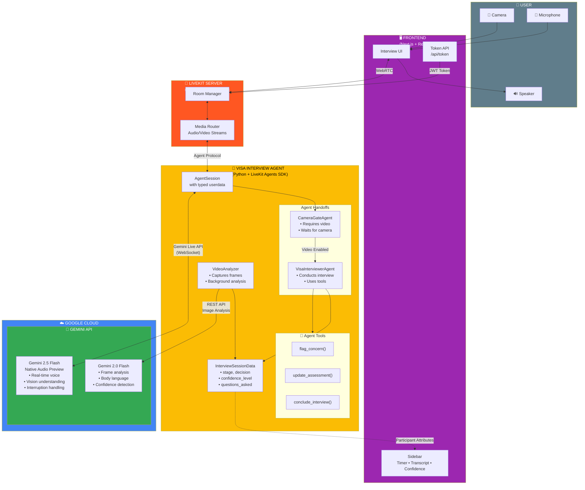
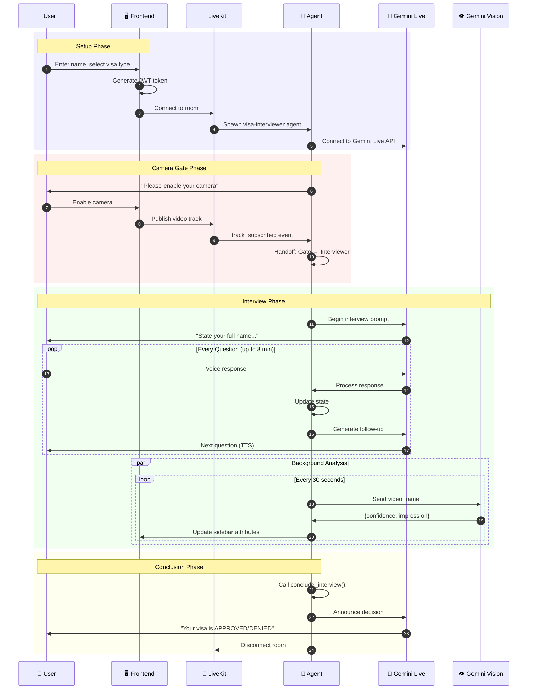
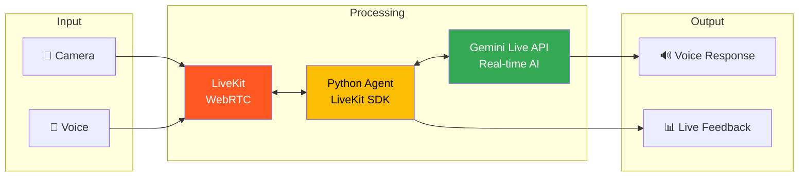

# Architecture Diagram

## How to Generate PNG

The diagrams below use Mermaid syntax. To generate PNG images:

1. **GitHub** - Just view this file on GitHub, diagrams render automatically
2. **Mermaid Live Editor** - Paste code at https://mermaid.live
3. **VS Code** - Install "Markdown Preview Mermaid Support" extension

---

## System Architecture

---

## Data Flow Sequence

---

## Simplified Overview (for slides)

---

## Technologies Used

| Layer | Technology | Purpose |
|-------|------------|---------|
| **Frontend** | Next.js 16, React 19, Tailwind CSS | User interface |
| **Real-time** | LiveKit, WebRTC | Audio/video streaming |
| **Agent** | Python 3.11, LiveKit Agents SDK | Agent runtime |
| **AI** | Gemini 2.5 Flash (Live), Gemini 2.0 Flash | Conversation + Vision |
| **Cloud** | Google Cloud Run (planned) | Production hosting |
